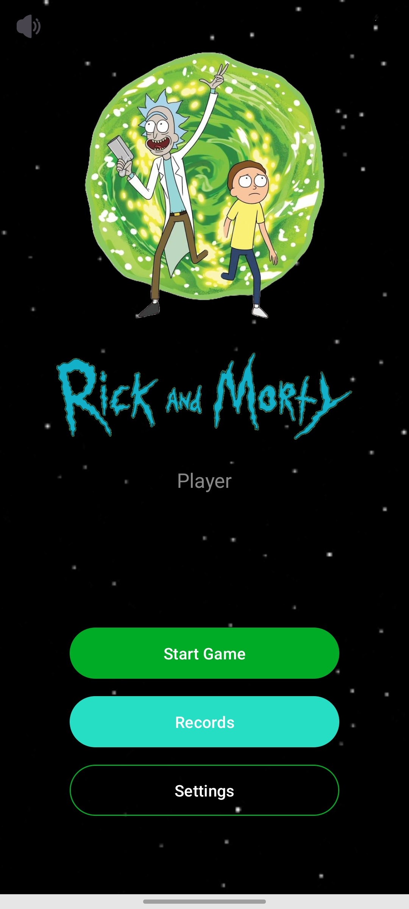
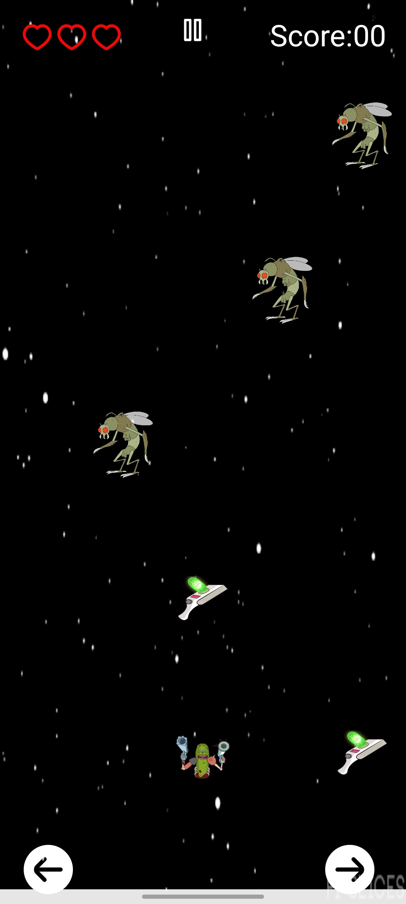

# Rick and Morty: Space Ship Game 🚀

A native Android arcade game developed in Kotlin. Help **Pickle Rick** dodge the Gromflomite soldiers and collect Portal Guns to survive!

## 📱 App Overview

This project demonstrates the use of Android core components, hardware sensors, and external libraries to create an engaging gaming experience. The player controls a spaceship on a 5x5 grid, aiming to survive as long as possible while the game speed increases dynamically.

## ✨ Key Features

* **Dual Control Modes:**
    * **Buttons:** Classic directional arrows.
    * **Sensors:** Tilt your device left or right to move (using the Accelerometer).
* **Dynamic Difficulty:** The game speed accelerates (`delay` decreases) as the score increases.
* **Location-Based Leaderboard:** High scores are saved with the user's GPS location (Latitude/Longitude) using Google Location Services.
* **Multimedia:**
    * Background music and sound effects (using `MediaPlayer` / `SoundPool`).
    * Haptic feedback (Vibration) on collisions.
* **Visuals:** Optimized image loading using **Glide**.

## 🛠️ Tech Stack & Libraries

* **Language:** Kotlin
* **UI:** XML Layouts, ViewBinding
* **Image Loading:** [Glide](https://github.com/bumptech/glide)
* **Location:** Google Play Services (FusedLocationProviderClient)
* **Sensors:** Android Sensor Manager (Accelerometer)
* **Architecture:** MVC pattern

## 📸 Screenshots

|                                Start Screen                                 |                           Gameplay (Buttons)                            |            Current Score            |             Top Scores             |
|:---------------------------------------------------------------------------:|:-----------------------------------------------------------------------:|:-----------------------------------:|:----------------------------------:|
|  |  |  |  |
*(Add your screenshots in a 'screenshots' folder in the repo)*

## 🎮 How to Play

1. Set your name in settings ('RandomPlayer' as default name).
2. Choose your control mode (Buttons or Sensors) from the main menu (Sensor mode is harder). 
3. Avoid the **Gromflomite Soldiers** falling from the top.
4. Catch the **Portal Guns** for bonus points (+10).
5. You have 3 lives (Hearts). Getting hit by an enemy reduces a life. 
6. Try to beat the high score!

## ⚙️ Setup & Installation

1.  Clone the repository:
    ```bash
    git clone [https://github.com/liranzoz/space_ship_game_2.git](https://github.com/liranzoz/space_ship_game_2.git)
    ```
2.  Open the project in **Android Studio**.
3.  Sync Gradle files.
4.  Run on an Emulator or a Physical Device (Physical device required for Sensor Mode and Vibration).
5.  **Note:** Grant Location permissions to enable the leaderboard feature.

## 👨‍💻 Author

**Liran Zozulya**
* [LinkedIn](www.linkedin.com/in/liran-zozulya-12b985269)
* [GitHub](https://github.com/liranzoz)

## ⚖️ Legal Notice
This application is a fan-made project developed solely for **educational and learning purposes only**, and is **not for profit**. It is not affiliated with, endorsed, or sponsored by *Adult Swim* or the creators of *Rick and Morty*. No copyright infringement is intended.

---
*Wubba Lubba Dub Dub!*